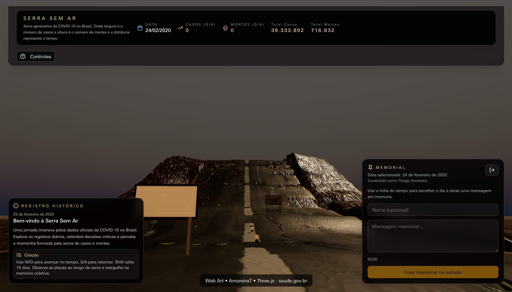
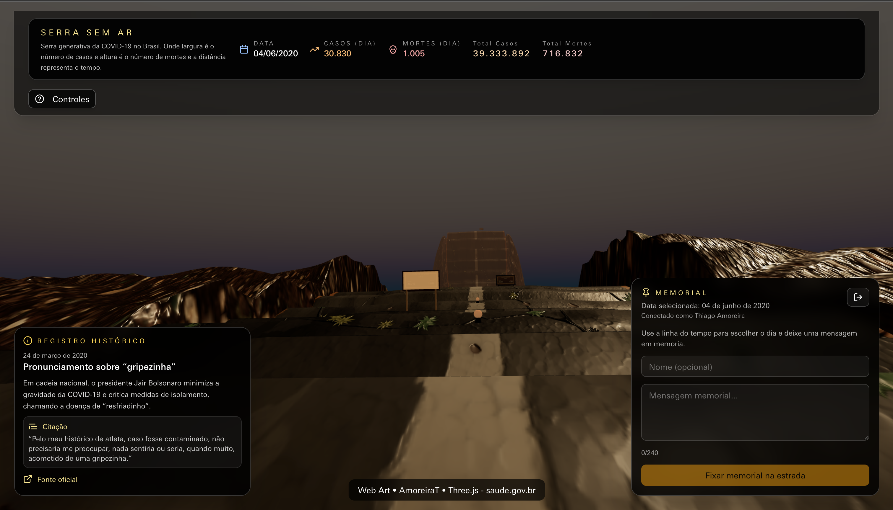

# SERRA SEM AR - COVID-19 no Brasil



Web Instalacao artistica interativa que transforma dados oficiais da COVID-19 no Brasil em uma montanha 3D navegavel. O usuario percorre uma estrada-tempo e pode registrar memoriais em datas especificas.

## Visao geral

- **Largura da montanha** representa casos diarios.
- **Altura da montanha** representa mortes diarias.
- **Distancia no eixo X** representa a passagem do tempo.
- **Estrada** e o caminho navegavel que acompanha a linha do tempo.
- **Memoriais** sao pins em forma de cruz criados por usuarios autenticados.

## Features

- Montanha 3D gerada a partir de dados oficiais do Ministerio da Saude.
- Navegacao em primeira pessoa com pointer lock.
- Timeline e HUD com dia e estatisticas.
- Placas mensais e registros historicos.
- Login Google via Firebase Auth.
- Memorials com backend simples em Cloud Functions + Firestore.
- Responsivo (mobile e desktop).

## Arquitetura

```
graph LR
  UI[React + Vite] --> Auth[Firebase Auth]
  UI --> Functions[Cloud Functions]
  Functions --> Firestore[(Firestore)]
  UI --> FirestoreRead[Firestore (read memorials)]
  Data[PortalGeral CSV] --> Script[scripts/fetch-brasil-covid-data.mjs]
  Script --> JSON[public/data/brasil-covid-daily.json]
  JSON --> UI
```

## Dados oficiais

O dataset vem do **PortalGeral** (Painel COVID-19 do Brasil). O script `scripts/fetch-brasil-covid-data.mjs` baixa o arquivo historico, extrai as linhas do Brasil e gera:

- `public/data/brasil-covid-daily.json`

Esse arquivo e lido no frontend pelo hook `useCovidData`.

### Atualizar dados

```bash
pnpm run update:data
```




## Como a montanha e criada (tecnica)

A geracao acontece em `src/components/Mountain3D.tsx`. O fluxo principal:

1) **Normalizacao dos dados**
   - `cases` e `deaths` sao normalizados pelo maximo da serie.
2) **Perfil por segmento de tempo**
   - O tempo vira `timeSegments` (min 120, max 1000).
   - Cada segmento recebe `halfWidth` (casos) e `ridgeHeight` (mortes).
3) **Smoothing**
   - Largura e altura passam por varias iteracoes de suavizacao (curvas mais fluidas).
4) **Secao transversal**
   - A montanha possui uma **estrada central**, um **plateau** e **encostas** laterais.
   - O perfil e composto por:
     - **Walkway** (estrada) com profundidade controlada
     - **Plateau** (transicao suave)
     - **Rampas/encostas** (queda ate a base)
5) **Ruido procedural**
   - Simplex noise 2D/3D adiciona dobras, ondulacoes e irregularidades naturais.
6) **Geometria final**
   - BufferGeometry com topo, base e laterais.
   - Texturas de rocha e estrada com UVs e normal maps.
7) **Revelacao progressiva**
   - Os segmentos vao "subindo" conforme a camera avanca pela linha do tempo.

### Curvas e relevo

- A largura da secao em cada dia nasce de `casesNorm`.
- A altura nasce de `deathsNorm`.
- Smoothing reduz picos abruptos para manter o fluxo visual.
- Ruido 3D garante variacao organica nas encostas.


## Memorial (backend simples)

### Fluxo

1) Usuario faz login Google.
2) Frontend grava direto em `memorials` no Firestore.
3) Regras validam schema e autenticacao.
4) Frontend le memorials e cria cruzes na estrada.

### Modelo de dados (memorials)

```json
{
  "date": "2020-03-11",
  "dateIndex": 15,
  "name": "Nome opcional",
  "message": "Mensagem memorial",
  "uid": "firebase-uid",
  "userName": "Nome do usuario",
  "userPhoto": "URL da foto",
  "createdAt": "server timestamp"
}
```

### Regras do Firestore

- Leitura publica para renderizar os pins.
- Escrita permitida apenas para usuarios autenticados.
- Validacao de campos e tamanhos diretamente nas rules.

### Cloud Functions (opcional)

Cloud Functions exigem o plano Blaze. O projeto ja possui `functions/` pronto para evolucao, mas no plano gratuito o memorial grava direto via Firestore.

## Estrutura do projeto

```
src/
  components/
    Mountain3D.tsx
    Scene3D.tsx
    EventMarkers3D.tsx
    MonthlyPlaques3D.tsx
    MemorialPanel.tsx
    MemorialPins3D.tsx
  hooks/
  stores/
  providers/
  services/
functions/
  src/index.ts
public/data/
  brasil-covid-daily.json
```

## Setup local

### Pre-requisitos

- Node 18+ (frontend)
- Node 22 (functions)
- Firebase CLI

### Variaveis de ambiente

Crie `.env` na raiz:

```
VITE_FIREBASE_APIKEY=...
VITE_FIREBASE_AUTHDOMAIN=...
VITE_FIREBASE_PROJECTID=...
VITE_FIREBASE_STORAGEBUCKET=...
VITE_FIREBASE_MESSAGINGSENDERID=...
VITE_FIREBASE_APPID=...
```

### Rodar local

```bash
pnpm install
pnpm dev
```

### Regras Firestore

```bash
firebase deploy --only firestore:rules
```

## Deploy

- Hosting: Vite build com Firebase Hosting.
- Firestore rules: `firebase deploy --only firestore:rules`.
- Functions: somente com plano Blaze.

## Creditos

- Ministerio da Saude (PortalGeral/Painel COVID-19)
- Three.js + React Three Fiber
- Firebase (Auth, Functions, Firestore)
