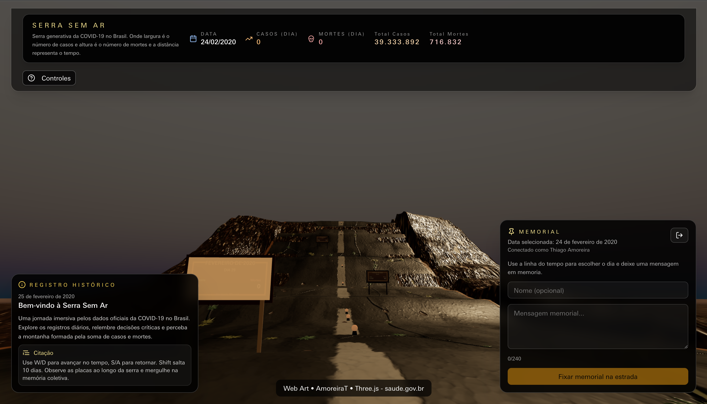
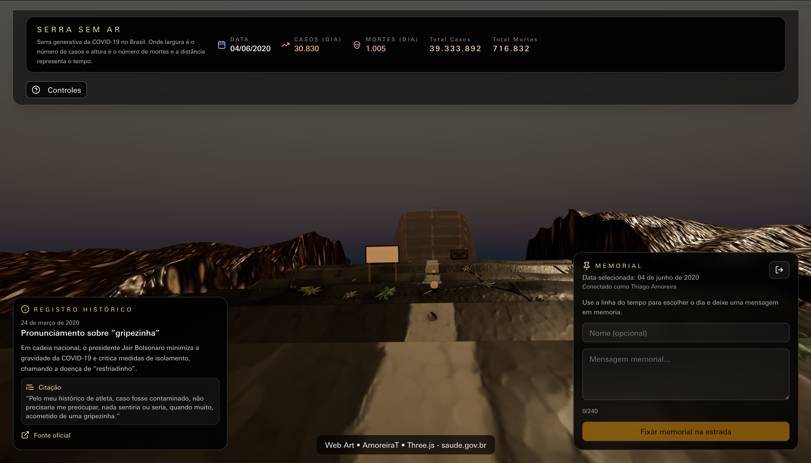
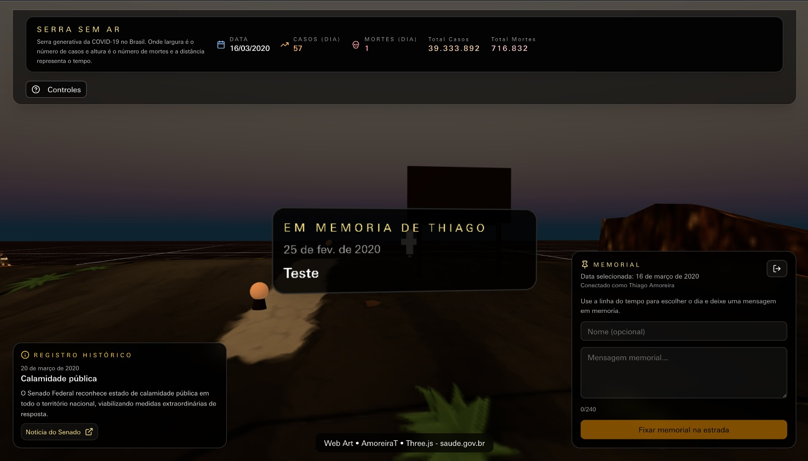

# SERRA SEM AR - COVID-19 no Brasil



Web Instalacao artistica interativa que transforma dados oficiais da COVID-19 no Brasil em uma montanha 3D navegavel. O usuario percorre uma estrada-tempo e pode registrar memoriais em datas especificas.

## Visao geral

- **Largura da montanha** representa casos diarios.
- **Altura da montanha** representa mortes diarias.
- **Distancia no eixo X** representa a passagem do tempo.
- **Estrada** e o caminho navegavel que acompanha a linha do tempo.
- **Memoriais** sao pins em forma de cruz criados por usuarios autenticados.

## Features

- Montanha 3D gerada a partir de dados oficiais do Ministerio da Saude.
- Navegacao em primeira pessoa com pointer lock.
- Timeline e HUD com dia e estatisticas.
- Placas mensais e registros historicos.
- Login Google via Firebase Auth.
- Memorials com backend simples em Cloud Functions + Firestore.
- Responsivo (mobile e desktop).

## Arquitetura

```
graph LR
  UI[React + Vite] --> Auth[Firebase Auth]
  UI --> Functions[Cloud Functions]
  Functions --> Firestore[(Firestore)]
  UI --> FirestoreRead[Firestore (read memorials)]
  Data[PortalGeral CSV] --> Script[scripts/fetch-brasil-covid-data.mjs]
  Script --> JSON[public/data/brasil-covid-daily.json]
  JSON --> UI
```

## Dados oficiais

O dataset vem do **PortalGeral** (Painel COVID-19 do Brasil). O script `scripts/fetch-brasil-covid-data.mjs` baixa o arquivo historico, extrai as linhas do Brasil e gera:

- `public/data/brasil-covid-daily.json`

Esse arquivo e lido no frontend pelo hook `useCovidData`.

### Atualizar dados

```bash
pnpm run update:data
```



## Como a montanha e criada (tecnica)

A geracao acontece em `src/components/Mountain3D.tsx`. O fluxo principal:

1. **Normalizacao dos dados**
   - `cases` e `deaths` sao normalizados pelo maximo da serie.
2. **Perfil por segmento de tempo**
   - O tempo vira `timeSegments` (min 120, max 1000).
   - Cada segmento recebe `halfWidth` (casos) e `ridgeHeight` (mortes).
3. **Smoothing**
   - Largura e altura passam por varias iteracoes de suavizacao (curvas mais fluidas).
4. **Secao transversal**
   - A montanha possui uma **estrada central**, um **plateau** e **encostas** laterais.
   - O perfil e composto por:
     - **Walkway** (estrada) com profundidade controlada
     - **Plateau** (transicao suave)
     - **Rampas/encostas** (queda ate a base)
5. **Ruido procedural**
   - Simplex noise 2D/3D adiciona dobras, ondulacoes e irregularidades naturais.
6. **Geometria final**
   - BufferGeometry com topo, base e laterais.
   - Texturas de rocha e estrada com UVs e normal maps.
7. **Revelacao progressiva**
   - Os segmentos vao "subindo" conforme a camera avanca pela linha do tempo.

### Curvas e relevo

- A largura da secao em cada dia nasce de `casesNorm`.
- A altura nasce de `deathsNorm`.
- Smoothing reduz picos abruptos para manter o fluxo visual.
- Ruido 3D garante variacao organica nas encostas.



## Memorial (backend simples)

### Fluxo

1. Usuario faz login Google.
2. Frontend chama a Cloud Function callable `createMemorial`.
3. A Function valida payload/autenticacao e grava em `memorials`.
4. Frontend le memorials e cria cruzes na estrada.

### Modelo de dados (memorials)

```json
{
  "date": "2020-03-11",
  "dateIndex": 15,
  "name": "Nome opcional",
  "message": "Mensagem memorial",
  "uid": "firebase-uid",
  "userName": "Nome do usuario",
  "userPhoto": "URL da foto",
  "createdAt": "server timestamp"
}
```

### Regras do Firestore

- Leitura publica para renderizar os pins.
- Escrita direta pelo cliente bloqueada.
- Memoriais permanentes sao criados por Cloud Functions.

### Cloud Functions

Cloud Functions exigem o plano Blaze. O memorial usa `createMemorial`; a co-presenca usa RTDB direto depois do join e o oxigenio coletivo e agregado por Function agendada.

## Oxigenio Coletivo e presenca online

O projeto usa um pipeline realtime com separacao entre estado efemero e permanente:

- `POST /api/presence/join` cria uma sessao anonima e grava em RTDB.
- Depois do join, o cliente escreve direto no RTDB em updates raros, quantizados e acionados por movimento.
- `POST /api/presence/leave` remove a presenca voluntariamente.
- `POST /api/presence/update` e `POST /api/oxygen/recalculate` ficam como compat/debug, mas nao sao chamados pelo frontend em navegacao normal.
- `aggregateOxygenScheduled` roda a cada 1 minuto e recalcula pressao e oxigenio coletivo.
- `cleanupStalePresence` roda a cada 5 minutos e remove sessoes antigas.

### Dados efemeros no Realtime Database

```txt
/realtimePresence/{sessionId}
/presenceRooms/{roomId}/{sessionId}
/worldState/oxygen
```

A posicao 3D nao e gravada no Firestore e nao ha historico permanente de movimento. `/realtimePresence` e o estado canonico para o backend; `/presenceRooms` e publico, leve e dividido por salas de 14 dias para renderizar visitantes proximos. O cliente escuta somente a sala atual e as vizinhas.

As posicoes sao quantizadas para 1 casa decimal. O cliente so escreve quando move pelo menos 2m, muda 7 dias na timeline ou vence o heartbeat de 45s. O intervalo minimo e 5s no desktop e 8s no mobile.

### Dados permanentes no Firestore

```txt
/memorials/{memorialId}
/dailyStats/{dateKey}
```

Firestore recebe apenas memoriais, estatisticas agregadas e registros criados por Function. O ultimo colapso direcionado fica em `/worldState/oxygen.lastCollapse`, permitindo notificacao sem leitura publica de `/collapseEvents`.

### Oxigenio

A configuracao inicial fica em `functions/src/services/oxygen.config.ts`:

```ts
baseDrain: 0.5
casesWeight: 25
deathsWeight: 45
crowdWeight: 1.75
mobileDrainMultiplier: 0.85
criticalThreshold: 25
collapseThreshold: 0
maxOnlineUsersSoftLimit: 30
```

Quando `collectiveOxygen <= 0`, o backend escolhe a presenca viva mais antiga, marca como `asphyxiated`, cria um evento `oxygen_depleted`, salva um memorial e recalibra o ar coletivo com uma presenca a menos.

`OxygenBar` e `OxygenWorldStatus` escutam `/worldState/oxygen`. O oxigenio individual e derivado no cliente a partir do coletivo, sem chamadas recorrentes para `/api/oxygen/recalculate`.

### Pegadas e performance

`PlayerPresence3D` usa pegadas como modo padrao em mobile e desktop. Cada visitante gera marcadores 2D simples no chao, em vez de milhares de particulas de chamas. As chamas ainda podem ser forçadas com `VITE_PRESENCE_MODE=flame`, mas esse modo e pesado para Safari mobile.

```bash
VITE_PRESENCE_MODE=footprint # padrao recomendado
VITE_ENABLE_PRESENCE=false   # desliga co-presenca remota, mantendo a obra local
```

### Renderizacao adaptativa

Por padrao, a obra escolhe automaticamente entre dois caminhos visuais:

- `3d`: WebGL completo, com montanha, ambiente, memoriais e efeitos para desktop.
- `2d`: canvas bidimensional de baixa memoria para Safari/iOS/mobile/tablet.

O modo 2D nao monta a cena WebGL e nao carrega as texturas grandes da montanha. Ele cria a ilusao de caminhada com estrada em perspectiva, serra em camadas, nevoa, pegadas de sangue e marcadores de co-presenca desenhados em canvas. A posicao continua sendo sincronizada no store e no RTDB, entao HUD, oxigenio e presenca permanecem ativos.

```bash
VITE_RENDER_MODE=auto # padrao: 2D apenas em mobile/tablet, 3D em desktop
VITE_RENDER_MODE=2d   # forca o modo leve para testar no desktop
VITE_RENDER_MODE=3d   # forca WebGL completo em aparelhos capazes
```

Esse caminho existe porque Safari movel pode encerrar paginas WebGL quando a memoria cresce. A troca para 2D reduz drasticamente geometria, texturas e uso de GPU, preservando a arte por composicao, profundidade falsa e movimento.

### Texturas baked para WebGL

A montanha 3D usa uma tecnica comum de jogos: bake de textura. Em vez de carregar varios mapas grandes de rocha/estrada (`baseColor`, `AO`, `normal`, `roughness`, `height`), o projeto gera uma textura WebP ja sombreada:

```bash
pnpm assets:bake-textures
```

O script `scripts/bake-game-textures.mjs` reduz e combina cor + oclusao ambiente em:

- `src/assets/textures/baked/rock_baked_1024.webp`
- `src/assets/textures/baked/road_baked_512.webp`

Isso corta transferencia, memoria de GPU e custo de shader. O relevo visual continua vindo principalmente da geometria procedural da serra, das sombras e da nevoa, nao de mapas pesados de displacement.

### Multiplayer opcional

A obra tem um prototipo multiplayer em `multiplayer-server/`, usando WebRTC/geckos.io. Ele e opcional: quando `VITE_ENABLE_MULTIPLAYER` nao esta ativo ou o servidor cai, o app continua com o fallback RTDB de baixo custo.

```bash
pnpm multiplayer:install
pnpm multiplayer:dev
```

No `.env` do frontend:

```bash
VITE_ENABLE_MULTIPLAYER=true
VITE_MULTIPLAYER_URL=http://localhost:9208
```

Em producao, `VITE_MULTIPLAYER_URL` precisa ser HTTPS para nao cair em bloqueio de mixed content. O servidor envia apenas visitantes proximos, filtrando por sala de `dayIndex` e distancia. Mobile recebe snapshots com menor frequencia. MavonEngine foi estudado como caminho de evolucao para entidades/servidor autoritativo; por enquanto usamos diretamente geckos.io, a base de transporte citada pela propria documentacao do Mavon, para manter o prototipo pequeno e menos arriscado.

### UI

- `OxygenBar` mostra o oxigenio individual.
- `OxygenWorldStatus` mostra o estado coletivo.
- `OxygenCollapseOverlay` escurece a obra, reduz a paisagem sonora e reinicia a caminhada.
- `MemorialMarkers` renderiza memoriais de colapso com instancing.

### Fallback e mobile

```bash
VITE_ENABLE_OXYGEN=false
VITE_ENABLE_OXYGEN_MEMORIALS=false
VITE_PRESENCE_API_BASE_URL=/api
```

Se Firebase/RTDB falhar no join, o app cria uma sessao local e mantem a obra funcionando sem sync remoto. Em modo online, desktop escreve no RTDB no maximo a cada 5s; mobile no maximo a cada 8s.

### Relatorio curto de custo

- Usuario parado: join + heartbeat RTDB raro, sem loop HTTP.
- Usuario caminhando por 2 minutos: ate ~24 writes RTDB no desktop ou ~15 no mobile.
- Cada update aceito grava o estado canonico em `/realtimePresence` e o marcador visual em `/presenceRooms`; nao ha write de posicao no Firestore.
- Recalculo de oxigenio roda pela Function agendada uma vez por minuto e grava `/worldState/oxygen`.
- Join gera 1 write em RTDB e 1 incremento agregado em `/dailyStats`.
- Leave/onDisconnect gera 1 delete efemero no RTDB.
- Colapso gera 1 update de presenca, 1 collapse event no RTDB, 1 memorial no Firestore e 1 incremento agregado.

### Deploy

Deploy das Functions e regras:

```bash
cd functions
pnpm install
pnpm build
firebase deploy --only functions:api,functions:aggregateOxygenScheduled,functions:cleanupStalePresence,functions:createMemorial
firebase deploy --only database,firestore:rules,hosting
```

### Alertas de orcamento (recomendado)

No Google Cloud Billing, configure alertas para 50%, 80% e 100% do orcamento mensal.

- Exemplo para meta de ~R$20/mes: criar budget em USD proximo de $4.
- Acima de 80%, o projeto entra em modo economico (intervalo maior).
- Em 100%, desligue `VITE_ENABLE_OXYGEN` temporariamente ou aumente os intervalos no backend.

### Script opcional de estimativa local

```bash
pnpm presence:estimate-cost --reads=1500000 --writes=400000 --downloadsGb=2.1 --functionsExecutions=2800000 --budgetUsd=4
```

O script retorna custo estimado e `recommendedPresenceSettings`.

## Estrutura do projeto

```
src/
  components/
    Mountain3D.tsx
    Scene3D.tsx
    EventMarkers3D.tsx
    MonthlyPlaques3D.tsx
    MemorialPanel.tsx
    MemorialPins3D.tsx
    oxygen/
    memorials/MemorialMarkers.tsx
  hooks/
    usePresenceSession.ts
    usePresencePositionSync.ts
    useMultiplayerPresence.ts
    useOxygenCollapseListener.ts
  stores/
    oxygenStore.ts
  providers/
  services/
    presenceApi.ts
    firebaseRealtime.ts
functions/
  src/http/
  src/services/
  src/scheduled/
  src/index.ts
multiplayer-server/
  src/server.ts
public/data/
  brasil-covid-daily.json
```

## Setup local

### Pre-requisitos

- Node 18+ (frontend)
- Node 22 (functions)
- Firebase CLI

### Variaveis de ambiente

Crie `.env` na raiz:

```
VITE_FIREBASE_APIKEY=...
VITE_FIREBASE_AUTHDOMAIN=...
VITE_FIREBASE_PROJECTID=...
VITE_FIREBASE_STORAGEBUCKET=...
VITE_FIREBASE_MESSAGINGSENDERID=...
VITE_FIREBASE_APPID=...
VITE_FIREBASE_DATABASEURL=...
VITE_ENABLE_OXYGEN=true # opcional
VITE_ENABLE_OXYGEN_MEMORIALS=true # opcional
VITE_ENABLE_PRESENCE=true # opcional
VITE_PRESENCE_MODE=footprint # opcional: footprint ou flame
VITE_ENABLE_MULTIPLAYER=false # opcional
VITE_MULTIPLAYER_URL=http://localhost:9208 # opcional
VITE_PRESENCE_API_BASE_URL=/api # opcional
```

### Rodar local

```bash
pnpm install
pnpm dev
```

### Regras Firebase

```bash
firebase deploy --only database,firestore:rules
```

## Deploy

- Hosting: Vite build com Firebase Hosting.
- Rules: `firebase deploy --only database,firestore:rules`.
- Functions: somente com plano Blaze.

## Creditos

- Ministerio da Saude (PortalGeral/Painel COVID-19)
- Three.js + React Three Fiber
- Firebase (Auth, Functions, Firestore)
